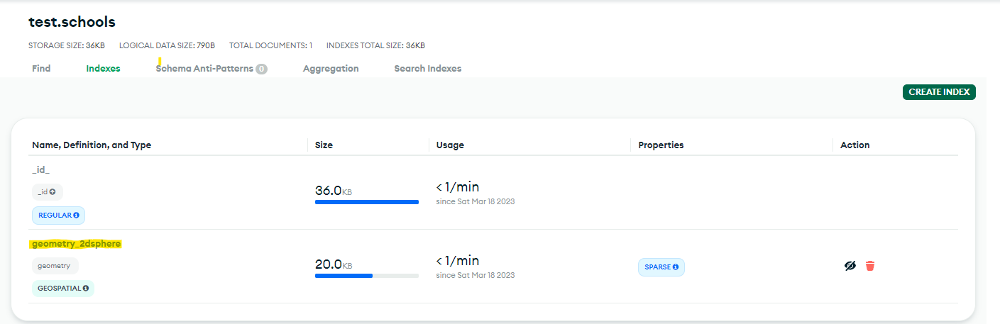
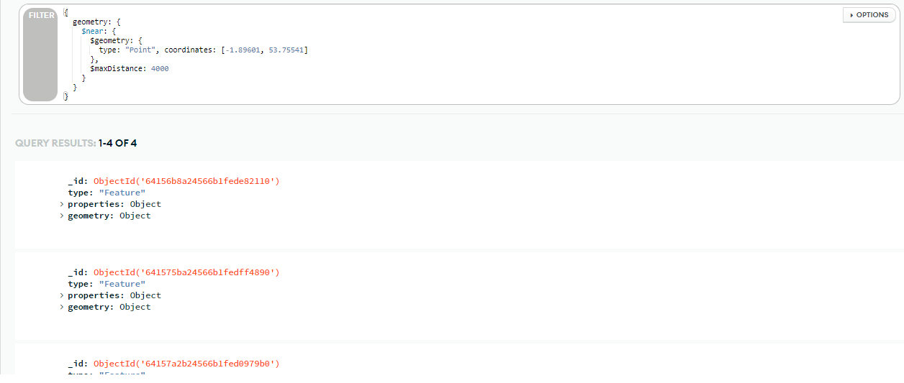
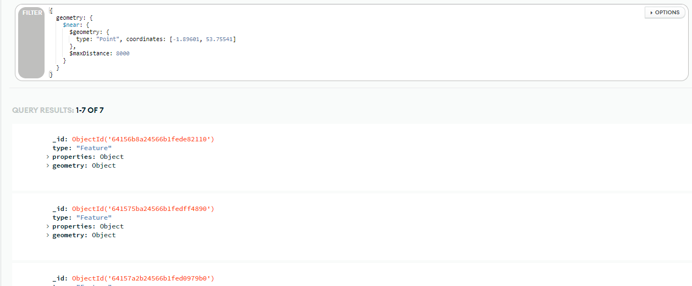
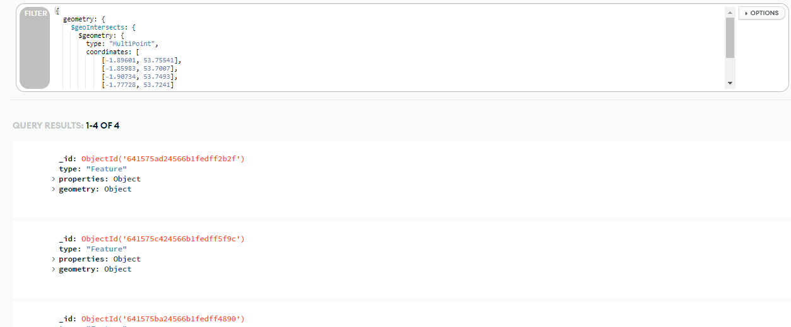

# Take Home Assignments

### Assadul Haq Muhammad Shani

## 1. MongoDB Geospatial Query

<br>

### <b>A. What is Geospatial Query?</b>

Geospatial Query is a feature in MongoDB allowing users to query geospatial data.
GEospatial data can be stored in `GeoJSON` or `coordinate pairs` format.

GeoJSON is used to calculate geometry on an Earth-like sphere, while coordinate pairs is used to calculate distance between 2 points on a Euclidean plane.

<br>

### <b>B. How to do Geospatial Query in MongoDB?</b>

First we need some data to work with, I'm using [School List GeoJSON from Calderdale Council](https://dataworks.calderdale.gov.uk/dataset/epwyy/schools-list). I inserted some of the data to MongoDB Atlas to try some queries on them.

Here is an example of the school data

```JSON
{
    "type": "Feature",
    "properties": {
        "DfE number": "2005",
        "Establishment": "Abbey Park Academy",
        "Phase": "Primary",
        ...
    },
    "geometry": {
        "type": "Point",
        "coordinates": [
            -1.89601,
            53.75541
        ]
    }
}
```

Some geospatial operations requires a geospatial index. There are 2 types of geospatial index:

1. 2dsphere <br>
   `2dsphere` index is used if we are working with Earth-like geometry
2. 2d <br>
   `2d` index is used for working on geometry on 2D plane.

Here I will be using `2dsphere` index on `geometry` field:


<br>

There are 4 operators on geospatial query:

1. `$geoIntersects`

   Selects geometries that intersect with a GeoJSON geometry

2. `$geoWithin`

   Selects geometries within a bounding GeoJSON geometry

3. `$near`

   Returns geospatial objects in proximity to a point. Requires a geospatial index.

4. `$nearSphere`

   Returns geospatial objects in proximity to a point on a sphere. Requires a geospatial index.

### <b>C. Geospatial Query Examples</b>

<br>

#### 1. Get data of schools with maximum distance of 4km from a coordinate pair <br>

```
{
  geometry: {
    $near: {
      $geometry: {
        type: "Point",
        coordinates: [-1.89601, 53.75541]
      },
      $maxDistance: 4000
    }
  }
}
```

<br>
result:



This query result in 4 records being retrieved, now I'll try to increase `$maxDistance` to get more data.

<hr>
<br>

#### 2. Get data of schools with maximum distance of 8km from a coordinate pair <br>

```
{
  geometry: {
    $near: {
      $geometry: {
        type: "Point",
        coordinates: [-1.89601, 53.75541]
      },
      $maxDistance: 8000
    }
  }
}
```

<br>
result:



Now we get 7 records, more than before as expected.

<hr>
<br>

#### 3. Get data of schools that intersects with a `MultiPoint` <br>

```
{
  geometry: {
    $geoIntersects: {
      $geometry: {
        type: "MultiPoint",
        coordinates: [
            [-1.89601, 53.75541],
            [-1.85983, 53.7007],
            [-1.90734, 53.7493],
            [-1.77728, 53.7241]
        ]
      }
    }
  }
}
```

<br>
result:



<br><hr><hr><hr><br>

## 2. MongoDB and ElasticSearch deployment on Kubernetes using Kind

Here are the steps I took to deploy MongoDB and ElsticSearch on Kubernetes using Kind:

<br>

### <b>1. Install Kind</b>
I am using Ubuntu 20.04 on WSL2.
```bash
curl -Lo ./kind https://kind.sigs.k8s.io/dl/v0.17.0/kind-linux-amd64
chmod +x ./kind
sudo mv ./kind /usr/local/bin/kind
```
I also installed `kubectl` to be able to interact with kubernetes clusters from command line.

<br>

### <b>2. Create a Cluster</b>
```bash
kind create cluster --config kubernetes_files/kindconfig.yaml
```
This creates a cluster with pre-built [kindest-node](https://hub.docker.com/r/kindest/node/) image.

I'm using the following config when creating the cluster cluster.
```yaml
kind: Cluster
apiVersion: kind.x-k8s.io/v1alpha4
nodes:
- role: control-plane
- role: worker
```
The idea is to have 1 control-plane node and 1 worker node, the worker node is going to host a pod which MongoDB and ElasticSearch will be deployed on. I plan to deploy both of them on the same pod so they have shared storage and networking.


Here is the list of currently available nodes.


### <b>3. Create a Pod and deploy MongoDB and ElasticSearch</b>

I use the following YAML file to create a pod named `db-pod` and deploy MongoDB and ElasticSearch on it.
```yaml
apiVersion: v1
kind: Pod
metadata:
  name: db-pod
spec:
  containers:
  - name: mongo
    image: mongo:latest 
    ports:
    - containerPort: 27017
  - name: elasticsearch
    image: docker.elastic.co/elasticsearch/elasticsearch:8.6.2-amd64
    ports:
    - containerPort: 9200
    - containerPort: 9300
```
Then I ran
```bash
kubectl apply -f kubernetes_files/deploy.yaml 
```
Here is explanation about the file:

a. `apiVersion` shows the version of Kubernetes APi used.

b. `kind` shows the type of Kubernetes Object that this file is working on

c. `metadata.name` shows the name of the pod

d. `spec` describes the desired state of the pod

e. `containers` lists the containers to be deployed on the pod.

f. The first container is MongoDB container. For the image I use mongo:latest. I expose port `27017`, the default port for MongoDB

g. The second container is ElasticSearch container. I exposed ports `9200` as the REST API port and `9300` as transport port.<br>
It seems that for elasticsearch image, the tag must be specified and we cannot use latest as the tag. So I tried to set the image to `elasticsearch:8.6.2`, but the pod creation failed. After exporting `Kind` log I saw that I got the following error:
```bash
Mar 19 07:44:59 kind-worker containerd[236]: time="2023-03-19T07:44:59.054587600Z" level=error msg="PullImage \"elasticsearch:8.2.6\" failed" error="rpc error: code = NotFound desc = failed to pull and unpack image \"docker.io/library/elasticsearch:8.2.6\": failed to resolve reference \"docker.io/library/elasticsearch:8.2.6\": docker.io/library/elasticsearch:8.2.6: not found"

```
so I used `docker.elastic.co/elasticsearch/elasticsearch:8.6.2-amd64` instead as showed in [here](https://www.docker.elastic.co/r/elasticsearch).

Now I got another error: the elasticsearch container failed to start because of `CrashLoopBackOff` error.
After researching about it I found that the cause could be an outdated docker version. The docker I had was `Docker version 20.10.21, build 20.10.21-0ubuntu1~20.04.1`.

So I ran
```bash
 sudo apt-get upgrade docker
 kubectl delete pod db-pod
 kubectl apply -f kubernetes_files/deploy.yaml 
```
And now all containers in the pod are ready, but not for long. The ElasticSearch container keeps crashing. So I tried to run the container using Docker without Kubernetes. The container crashed too wher being run using Docker, and in the logs I found that the problem was that `vm.max_map_count` was too low. 

So I updated `/etc/sysctl.conf` and set `vm.max_map_count=262144` as recommended in the logs. Now when I run the container using Docker and everything went well. 

I redeployed the pod after updating `vm.max_map_count` and now both containers are running.


<small>The pod have been running for 14 minutes and have no problem.</small>


### <b>4. Check HTTP Readiness of the Containers</b>

To check the readiness of the containers, first I forward the ports on my local machine to the ports of the containers.

For MongoDB:
```bash
 kubectl port-forward db-pod 27018:27017
```
For ElasticSearch:
```bash
 kubectl port-forward db-pod 9201:9200
```

Here are the check results

1. MongoDB <br><br>


<br>

2. ElasticSearch <br><br>
